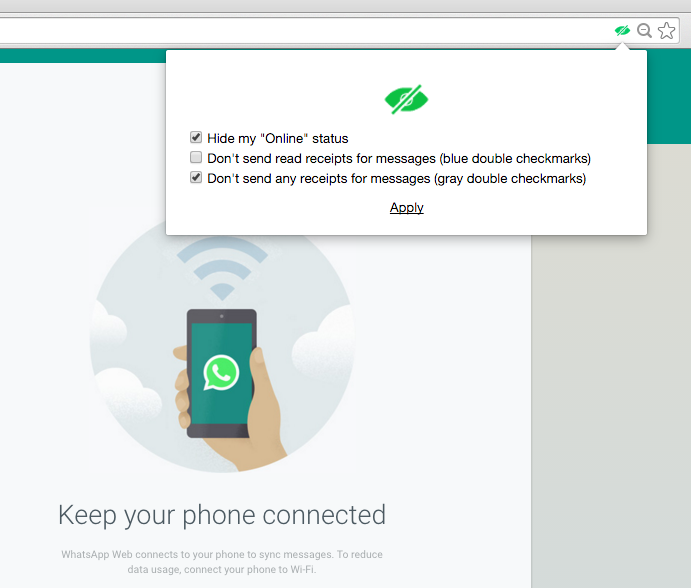

# WhatsHide 

**Invisible mode for the WhatsApp Web client (Chrome extension)**

  - Disable Online status sharing
  - Disable read receipts for messages (blue checkmarks)
  - Disable receipts for messages (gray double checkmarks)

**Note:** valid only when using the WhatsApp Web client. The extension will hide your Online status and receipts as long as the mobile app stays in the background.

### Screenshots

### How this works - prototype hijacking
The WhatsApp Web client uses WebSockets to communicate with the server. The extension hijacks the WebSocket object, injecting its own Send() and Receive() functions to the WebSocket prototype that filter the relevant messages. Read more about prototype hijacking [here][l1].

### Installation
Download repo, unpack, go to chrome://extensions and select "Load unpacked extension". Refresh the Web client and a green icon will appear in the address bar.

[l1]: <http://blog.kotowicz.net/2011/01/xss-track-as-html5-websockets-traffic.html>
